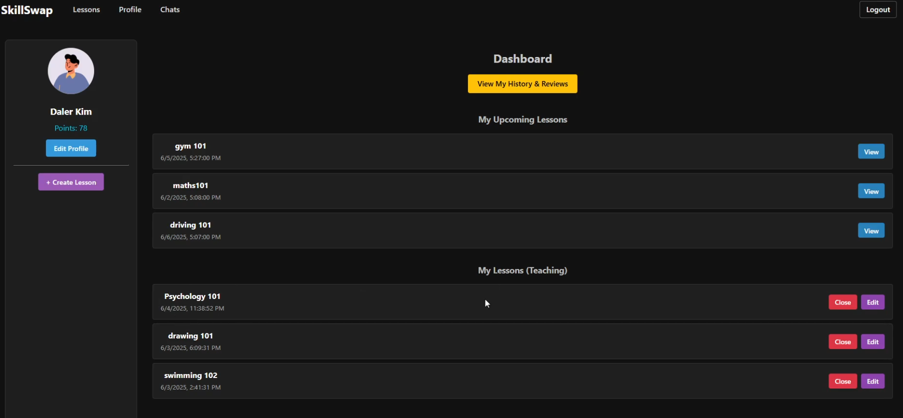
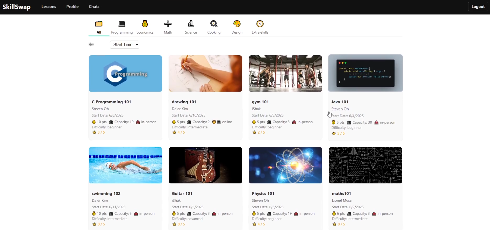
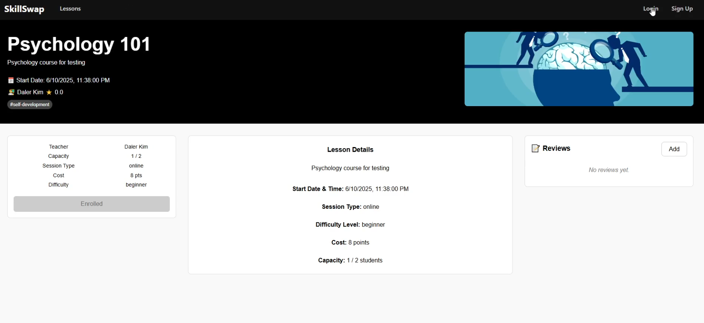
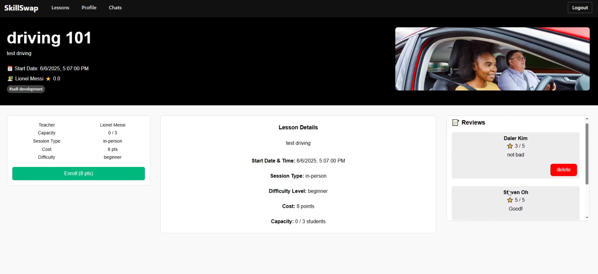
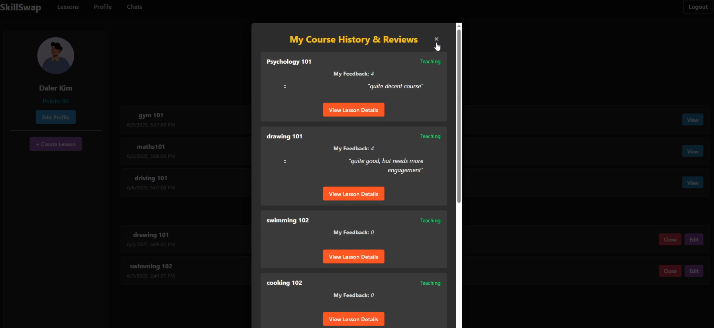

# 🎓 SkillSwap

> A campus-only platform where students teach and learn new skills using a simple point system



## 🌟 What is SkillSwap?

SkillSwap is a peer-to-peer learning platform designed exclusively for campus communities. Instead of expensive private lessons or unreliable group chats, students can share knowledge using a point-based system - no money involved, just effort and learning.

### ✨ Key Features

- **🎯 Campus-Only Access** - Secure authentication with campus email verification
- **📚 Easy Lesson Creation** - Host lessons in minutes with simple scheduling
- **⭐ Trust & Rating System** - Build reputation through feedback and reviews
- **💬 Real-time Chat** - Communicate with hosts and students instantly
- **🔄 Monthly Resets** - Fresh points every month to keep the community active
- **📊 Personal Dashboard** - Track your learning journey and teaching history

## 🚀 How It Works

1. **Sign Up** with your campus email and receive 100 welcome points
2. **Create Lessons** or browse available sessions by other students
3. **Book & Learn** using your points to join lessons
4. **Teach & Earn** points by hosting your own lessons
5. **Rate & Review** to help build a trusted community

## 🛠️ Tech Stack

- **Frontend**: React + Tailwind CSS
- **Backend**: Node.js + Express
- **Database**: PostgreSQL + Firestore
- **Authentication**: Firebase
- **Deployment**: Heroku (Frontend moving to Vercel)

## 📱 Screenshots

### Lesson Feed

*Browse and filter available lessons by time, rating, and cost*

### Lesson Details

*View detailed information about any lesson before booking*

### Lesson with Feedback

*See reviews and ratings from previous participants*

### Feedback History

*Track your teaching and learning journey*

### User Dashboard

*Monitor your points, upcoming lessons, and achievements*

## 🎯 Project Goals

- Keep the platform limited to campus community
- Enable short, peer-led lessons
- Use point-based system instead of payment
- Encourage regular use with resets and feedback
- Build a stronger learning culture on campus

### Installation

1. **Clone the repository**
   ```bash
   git clone https://github.com/DK1603/SkillSwap.git
   cd SkillSwap
   ```

2. **Set up environment variables**
   ```bash
   touch .env
   # Fill in your Firebase configuration
   ```

3. **Install dependencies**
   ```bash
   # Backend
   cd backend
   npm install
   
   # Frontend
   cd ../frontend
   npm install
   ```

4. **Start the development servers**
   ```bash
   # Backend (from backend directory)
   npm start
   
   # Frontend (from frontend directory)
   npm run dev
   ```


## 🤝 Contributing

We welcome contributions! Please feel free to submit a Pull Request.

---

**SkillSwap** - *No money, just effort and sharing* 🎓✨